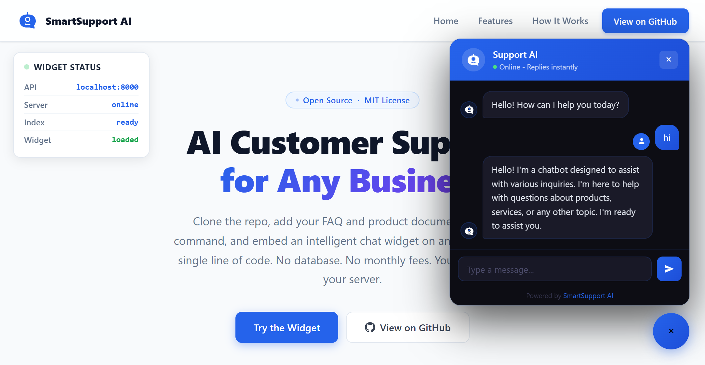

<div align="center">


# SmartSupport AI

### Open-Source AI Customer Support &nbsp;·&nbsp; RAG &nbsp;·&nbsp; FAISS &nbsp;·&nbsp; SmolLM2 &nbsp;·&nbsp; One Script Tag

**Add your documents → Build the index → Embed on any website in minutes.**

<br/>

[](LICENSE)
[](https://python.org)
[](https://fastapi.tiangolo.com)
[](https://gradio.app)
[](https://huggingface.co/spaces)
[](https://github.com/facebookresearch/faiss)
[](CONTRIBUTING.md)
[](https://github.com/apdoolhamza/smartsupport-ai/stargazers)

<br/>

**[Quick Start](#quick-start)** &nbsp;·&nbsp; **[ Live Demo](https://apdoolhamza.github.io/smartsupport-ai/)** &nbsp;·&nbsp; **[Documentation](DOCS.md)** &nbsp;·&nbsp; **[Issues](https://github.com/apdoolhamza/smartsupport-ai/issues)** 

</div>
---
<table>
  <tr>
    <td></td>
  </tr>
</table>


## Summary

**SmartSupport AI** is an open-source AI customer support tool that any business can clone, train on their own documents, and embed on their website with no AI experience required and no monthly fees.

It uses **Retrieval-Augmented Generation (RAG)**: your documents are split into chunks, converted to vector embeddings, and stored in a FAISS index. When a customer asks a question, the most relevant chunks are retrieved and passed to a local language model to generate a precise, grounded answer.

> **Unlike SaaS chatbot tools:** you own the data, the model runs on your server, there are no per-query costs, and the entire stack is free to self-host.

## Features

| | Feature | Description |
|:---:|:---|:---|
| | **RAG Pipeline** | FAISS vector search + sentence-transformers for accurate, grounded answers |
| | **Folder-based Setup** | Drop files in `documents/`, run one command - no coding required |
| | **No Database** | All knowledge stored as files on disk - zero infrastructure to set up |
| | **One-line Embed** | A single `<script>` tag installs the full chat widget on any website |
| | **Full Customization** | Bot name, brand colors, welcome message, and position - all via `.env` |
| | **Multi-format Support** | Plain text, Markdown, and PDF documents supported |
| | **Streaming Responses** | Token-by-token streaming via Server-Sent Events |
| | **REST API** | Clean FastAPI backend with health check and chat endpoints |

## Project Structure

```
smartsupport-ai/
│
├── documents/                  ← PUT YOUR BUSINESS FILES HERE
│   ├── faq.txt                   Your questions and answers
│   └── products.txt              Your product catalog
│
├── backend/
│   ├── main.py                   FastAPI server - /api/chat, /widget.js, /health
│   └── rag_engine.py             Chunking, embedding, FAISS search, generation
│
├── widget/
│   └── widget.js                 Embeddable chat widget - pure JS, zero dependencies
│
├── scripts/
│   └── build_index.py            Run this once after adding your documents
│
├── index/                      ← AUTO-CREATED - do not edit manually
│   ├── faiss.index               Vector index (binary)
│   ├── metadata.json             Text chunks with source filenames
│   └── embed_cache.json          Hash → vector cache for fast re-indexing
│
├── requirements.txt
├── .env.example
├── README.md
└── DOCS.md
```

## Quick Start

**Requirements:**

```
Python 3.10, 3.11, or 3.12
Git
4 GB RAM minimum
Internet connection  (downloads models ~500 MB on first run)
```

**Step 1 - Clone**

```bash
git clone https://github.com/apdoolhamza/smartsupport-ai.git
cd smartsupport-ai
```

**Step 2 - Install**

```bash
python -m venv venv
source venv/bin/activate          # Windows: venv\Scripts\activate

pip install -r requirements.txt
```

**Step 3 - Add your documents**

Open the `documents/` folder. Replace the sample files with your own content:

```
documents/
├── faq.txt        ← your questions and answers
└── products.txt   ← your product catalog
```
Write your FAQ in plain text using `Q` & `A` format:

```
Q: What are your opening hours?
A: We are open Monday to Friday, 9 AM to 6 PM,
   and Saturday 10 AM to 4 PM. Closed on Sundays.
```

**Step 4 - Build the index**

```bash
python scripts/build_index.py
```
This reads every file in `documents/` and builds the FAISS index. You will see output like: 

```
Found 2 document(s):
  - faq.txt
  - products.txt

Reading: faq.txt ...... OK (4,200 characters)
Reading: products.txt . OK (8,100 characters)

Building index...

Index built successfully.
Documents : 2  |  Chunks : 62  |  Vectors : 62
```

**Step 5 - Configure**

```bash
cp .env.example .env
```
Open `.env` and set your bot settings: 

```env
API_BASE_URL=https://your-server.com
BOT_NAME="Support AI"
PRIMARY_COLOR=#2563eb
SECONDARY_COLOR=#1d4ed8
WELCOME_MESSAGE=Hello! How can I help you today?
FALLBACK_MESSAGE="..."
WIDGET_POSITION=bottom-right
BUTTON_SIZE="56px"
API_KEYS=ss-abc123 (Optional)
...
```

**Step 6 - Start the server**

```bash
uvicorn backend.main:app --host 0.0.0.0 --port 8000 --reload
```
The server starts at `http://localhost:8000`.

**Step 7 - Open in your browser**

```
http://localhost:8000/health    ← confirm the server is running
```

Models download automatically on first run. After that they load from cache in seconds.

**Step 8 - Embed on Your Website**

Once your server is running, add one line to your website before `</body>`:

```html
<script src="https://your-server.com/widget.js"></script>
```

A chat button appears on your website. Your customers can now get instant, accurate answers from your documents.

**Note:** If you set API Key in `.env` file, then you must set the key before the embed script in your website. You can also set the Bot config  settings here:

```html
<script>
window.__SS_CONFIG__ = {
    apiBase:        "https://your-server.com",
    botName:        "Support AI",
    primaryColor:   "#2563eb",
    secondaryColor: "#1d4ed8",
    welcomeMessage: "Hello! How can I help you today?",
    position:       "bottom-right",
    buttonSize:     "56px",
    apiKey:         "ss-abc123"    // must match EXACTLY what is in .env API_KEYS
};
</script>
 
<script src="https://your-server.com/widget.js"></script>
```

## Customization

All customization is done through environment variables in `.env` or in your website before `</body>` closing tag. No code changes needed. Restart the server after editing.

| Variable | What It Controls | Default |
|:---|:---|:---|
| `BOT_NAME` | Name shown in the chat header | `Support AI` |
| `PRIMARY_COLOR` | Button color, user bubbles, and accent elements | `#2563eb` |
| `SECONDARY_COLOR` | Gradient secondary color | `#1d4ed8` |
| `WELCOME_MESSAGE` | First message sent when the widget opens | `Hello! How can I help you today?` |
| `FALLBACK_MESSAGE` | Reply when no relevant answer is found | See `.env.example` |
| `WIDGET_POSITION` | `bottom-right` or `bottom-left` | `bottom-right` |
| `BUTTON_SIZE` | Size of button  | `56px`

## API Reference

Interactive docs available at `http://localhost:8000/docs`

| Method | Endpoint | Description |
|:---:|:---|:---|
| `GET` | `/health` | Server status and index statistics |
| `POST` | `/api/chat` | Submit a question, receive a full answer |
| `POST` | `/api/chat/stream` | Submit a question, receive a streamed response |
| `GET` | `/widget.js` | Chat widget with configuration pre-injected |

## Contributing

```bash
git checkout -b feat/your-feature
git commit -m "feat: describe your change"
git push origin feat/your-feature
```

---

<div align="center">

**MIT License** · Built by [apdoolhamza](https://github.com/apdoolhamza)

If this saved you time, a star helps others find it.

[](https://github.com/apdoolhamza/smartsupport-ai/stargazers)
</div>
